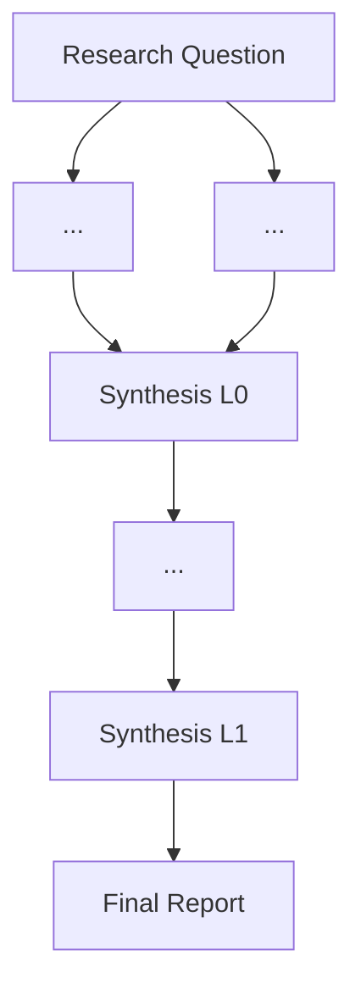

# /deep-research -- Iterative Deep Research via Codex + tmux

Decompose a research question using MECE principles, spawn parallel Codex
agents in tmux panes for web research, synthesize findings in-context,
identify gaps, spawn deeper agents, and repeat until coverage is sufficient.

**Architecture:** Claude = brain (orchestrator, decomposer, synthesizer).
Codex = legs (parallel web research in tmux panes). Zero `claude -p` automation.

```
    Research Question
          |
    [MECE Decompose]         Claude thinks
          |
    +-----+-----+
    v     v     v
  [Codex] [Codex] [Codex]   Level 0: broad sweep
    +-----+-----+
          |
    [Synthesis L0]           Claude thinks, finds gaps
          |
    +-----+-----+
    v           v
  [Codex]     [Codex]       Level 1: targeted deep dives
    +-----+-----+
          |
    [Synthesis L1]           Claude thinks, enough?
          |                     |
    [Level 2...]          [Final Report]
```

## Argument

A research topic or question. Example:
"state of production LLM applications best practices 2026"

## Procedure

### Phase 1 -- Understand

Clarify the research question. Identify:
- The core topic and scope
- The timeframe (if any)
- How many dimensions / angles the user wants covered
- Desired depth (surface scan vs exhaustive)
- Whether adversarial / contrarian coverage is wanted

If unclear, ask the user before proceeding.

### Phase 2 -- MECE Decompose (Level 0)

Split the research into 3-6 independent domains. For each domain,
create 1-2 search variants (a/b) that approach from different angles.

Decomposition rules:
- Divide by **research domain**, NOT by source type
- Each variant should use different search terms and angles
- All domains together must be collectively exhaustive -- no gaps
- Prioritize exhaustiveness over exclusivity

Present the decomposition table and wait for user approval:

```
| # | Node ID           | Domain     | Angle                  |
|---|-------------------|------------|------------------------|
| 1 | L0_frameworks_a   | Frameworks | Production-ready tools |
| 2 | L0_frameworks_b   | Frameworks | Benchmark comparisons  |
| 3 | L0_reliability_a  | Reliability| Failure postmortems    |
| 4 | L0_security_a     | Security   | OWASP LLM top 10      |
| 5 | L0_security_b     | Security   | Compliance & legal     |
```

Do NOT proceed until the user approves this decomposition.

### Phase 3 -- Create Prompts + Launch Codex Agents

#### 3a. Create output directories and prompts

For each agent, create the directory and write the prompt:

```bash
mkdir -p output/{node_id}
```

Write `output/{node_id}/prompt.md` with this structure:

```markdown
You are a research agent. DO NOT modify any files in any codebase.
Your ONLY job is to search the web and compile findings.

# Mission: [Specific research goal for this agent]

## Search Strategy
[10+ specific search queries, tailored to this agent's angle]
[Mix of site:-restricted queries for authoritative sources and broad queries]

## What to Capture
For each useful source:
1. URL
2. Title
3. Key points (3-5 bullets)
4. Confidence: high (official/peer-reviewed), medium (reputable blog), low (forum/anecdotal)
5. Relevant excerpt

## Output Format

### Findings

**Source: [Title](URL)**
- Confidence: high/medium/low
- Key points:
  - ...
- Excerpt: "..."

[Repeat for each source]

### Summary
[2-3 paragraphs answering the research question based on findings]

### Sources List
[Flat list of all URLs cited]
```

For Level 1+ agents (deeper research), enrich the prompt:

```markdown
You are a research agent. DO NOT modify any files in any codebase.
Your ONLY job is to search the web and compile findings.

# Context from prior research
[Inject relevant findings from previous synthesis]

# What we already know
[Summary so agent doesn't re-discover known facts]

# Mission: [Targeted question addressing a specific gap]

# What we need
[Specific evidence or sources that would resolve the gap]

## Search Strategy
[Targeted queries based on identified gaps]

## What to Capture
[Same structured format as above]

## Output Format
[Same structured format as above]
```

Prompt design rules:
- **Always** start with "DO NOT modify any files"
- **10+ search queries per agent** for breadth
- **Structured output format** for aggregation
- **Variance between a/b agents** -- different terms for same domain

#### 3b. Build tmux session and launch

Calculate layout: ceil(total_agents / 4) windows, up to 4 panes each.

Create the session:

```bash
SESSION="deep-research"
tmux has-session -t $SESSION 2>/dev/null && SESSION="deep-research-$(date +%s)"
tmux new-session -d -s $SESSION -x 220 -y 55
```

For each window of 4 panes:

```bash
# Additional panes (first pane exists by default)
tmux split-window -t $SESSION:{window}
tmux split-window -t $SESSION:{window}
tmux split-window -t $SESSION:{window}
tmux select-layout -t $SESSION:{window} tiled

# VALIDATE before launching
tmux list-panes -t $SESSION:{window} -F "#{pane_index}"
```

CRITICAL: **Always validate pane count** before sending commands.

Launch each agent:

```bash
tmux send-keys -t $SESSION:{window}.{pane} -l -- "cat output/{node_id}/prompt.md | /opt/homebrew/bin/codex exec -m gpt-5.4 --full-auto - 2>&1 | tee output/{node_id}/output.md ; echo '=== RESEARCH AGENT COMPLETE ==='"
sleep 0.2
tmux send-keys -t $SESSION:{window}.{pane} Enter
```

After launching, verify processes:
```bash
ps aux | grep "codex exec" | grep -v grep | wc -l
```

Print monitoring instructions:
```
Attach: tmux attach -t $SESSION
Switch windows: Ctrl-b n / Ctrl-b p
Switch panes: Ctrl-b + arrows
Zoom pane: Ctrl-b z
```

### Phase 4 -- Monitor + Collect

Poll all panes for the completion marker:

```bash
for pane in {list of session:window.pane targets}; do
  while true; do
    if tmux capture-pane -t $pane -p -S -10 2>/dev/null | grep -q "RESEARCH AGENT COMPLETE"; then
      echo "$pane: DONE"
      break
    fi
    dead=$(tmux display-message -t $pane -p '#{pane_dead}' 2>/dev/null)
    if [ "$dead" = "1" ]; then
      echo "$pane: PROCESS DIED"
      break
    fi
    sleep 10
  done
done
```

After all agents complete, capture scrollback as backup (codex tee
truncation workaround):

```bash
tmux capture-pane -t $SESSION:{w}.{p} -p -S - > output/{node_id}/scrollback.txt
```

Read all output files. If `output.md` is truncated (fewer than 20 lines),
use `scrollback.txt` instead.

### Phase 5 -- Intermediate Synthesis (Level N)

Read every `output/{L{N}_*}/output.md` file from the current level.

Cross-reference the findings and write `output/synthesis_L{N}.md`:

```markdown
# Synthesis Level {N}: {topic}

## Key Findings by Domain
### {Domain 1}
- Finding with [source attribution](url)
...

## Cross-Domain Patterns
[Themes appearing across multiple domains -- highest value findings]

## Contradictions and Tensions
[Where sources disagree. Note which evidence is stronger and why]

## Evidence Gaps
[Areas with weak or missing coverage that need deeper investigation]
- Gap 1: [description] -- suggested queries: [...]
- Gap 2: [description] -- suggested queries: [...]

## New Questions Spawned
[Questions raised by the findings that weren't in the original decomposition]
```

Present the synthesis to the user.

### Phase 6 -- DAG Extension (if gaps exist)

After presenting the synthesis, assess whether deeper research is needed.
Consider:
- Are there significant evidence gaps?
- Are there unresolved contradictions?
- Did findings raise important new questions?
- Has the user requested specific deeper investigation?

If deeper research IS needed (and current level < max depth of 2):
1. Generate new sub-questions targeting gaps/contradictions
2. Assign node IDs: `L{N+1}_{domain}_{variant}`
3. Present the new agents table for user approval
4. Loop back to Phase 3

If deeper research is NOT needed (or user says "enough"):
Proceed to Phase 7.

### Phase 7 -- Final Synthesis

Produce `output/synthesis_final.md` combining all levels:

```markdown
# Final Research Synthesis: {topic}

## Executive Summary
[3-5 sentences: the answer to the original question]

## Key Themes
1. Theme (confidence: high/medium/low)
   - Supporting evidence from L0, L1, etc.
2. ...

## Detailed Findings
[Organized by theme, with full source attribution]

## Contradictions
[How they were resolved across levels, or why they remain open]

## Remaining Gaps
[What this research did NOT cover adequately]

## Research DAG Executed
[Mermaid diagram -- see Phase 8]

## Source Index
| Level | Agent | Domain | Key Sources |
|-------|-------|--------|-------------|
| L0 | {id} | {domain} | [URLs] |
| L1 | {id} | {domain} | [URLs] |
```

### Phase 8 -- Write Final Report

Write `output/report.md` -- a polished, publishable research report:

- Executive summary (readable standalone)
- Research landscape (mermaid diagram of the DAG executed)
- Detailed findings by theme with confidence levels and citations
- Contradictions and open questions
- Conclusions and recommendations
- Full source list grouped by level and domain

Generate the mermaid DAG diagram showing the actual research path:



## Troubleshooting

**Agent stuck / no output after 5+ minutes:**
```bash
tmux capture-pane -t deep-research:{w}.{p} -p -S -20
```
Look for errors. Common: codex rate limit, model not supported, network issues.

**tee output truncated (known codex issue):**
```bash
tmux capture-pane -t deep-research:{w}.{p} -p -S - > output/{node_id}/scrollback.txt
```
Use scrollback as the authoritative output.

**Re-run a single failed agent:**
```bash
tmux send-keys -t deep-research:{w}.{p} -l -- "cat output/{node_id}/prompt.md | /opt/homebrew/bin/codex exec -m gpt-5.4 --full-auto - 2>&1 | tee output/{node_id}/output.md ; echo '=== RESEARCH AGENT COMPLETE ==='"
sleep 0.2
tmux send-keys -t deep-research:{w}.{p} Enter
```

**All agents rate-limited:**
Stagger launches with `sleep 30` between `send-keys`, or reduce parallel count.

## Important

- NEVER use `claude -p` for research agents. Use `/opt/homebrew/bin/codex exec` only.
- Always decompose by **research domain**, never by source type.
- Always wait for user approval of decomposition before launching agents.
- Always validate tmux panes exist before sending commands.
- Always capture scrollback as backup after agent completion.
- Default max depth: 2 levels. User can override with "go deeper" or "enough".
- The tmux session name is `deep-research`. Check for existing sessions first.
